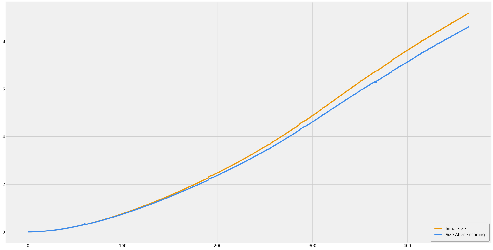

<h2>📚 Resume</h2>

This is a full Modern C++ Object Oriented library for PNG file format Encode/Decode.<br>
This library designed to be tiny as possible, purpose severals functions that make easier Pixels Manipulations inside PNG images.

<h2>💡 Idea</h2>

...Some day, I was looking for a structured PNG library written in C++ for my project. but I could not find anything simple enough, lightweight and Modern. Everything what I tried required 'old c methods' to integrate or had some limitations or was too heavy. I wanted something powerfull and small enough, following new coding 'standards'. <br>This was the reason why I decided to write this Encoder/Decoder, which no need to manipulate directly memory, with OOP and exceptions features. 

<h2>🛠️ Features</h2>

- full OOP paradigm
- Exceptions Handling
- multiple IDAT chunks
- auto-detect endianess
- PHYS additionnal chunk
- CRC32 computing algortithm
- Hardware-independent processing
- compress ratio option for encode 
- Simple and double bit Depths (8 & 16)
- Partial Parsing(rapid informations retrieve)
- Various colors modes (grayscale, grayscale alpha, RGB, RGBA)
- MultiThreading dynamic scanline filtering(better time-size compress ratio)  

<h2>⚙️ Building</h2>
Makefile and Windows compiling files are provided, just copy src and includes files in your project folder.<br>
This project use zlib, so to avoid using dll is to directly include zlib source into your project. 

<h2>🏴󠁶󠁥󠁷󠁿 Dependencies </h2>
zlib 1.2.3 

<h2>📈 Performance</h2>
Here down is a graph that show efficiency of the multithread dynamic scanline filtering method.<br>
A set of 512 images was used to generate this graph,<br>
Where each image is a downscaled version of an initial image, to make this repeatable<br><br>
Script for image downscale:

```python:
from PIL import Image

for i in range(1, 512 + 1, 1): 
    basewidth = 10*i
    img = Image.open('red.png')
    wpercent = (basewidth/float(img.size[0]))
    hsize = int((float(img.size[1])*float(wpercent)))
    img = img.resize((basewidth,hsize), Image.Resampling.LANCZOS)
    img.save("./out/{:.1f}".format(i) + ".png")
```
<br>Build on :
```
Intel(R) Core(TM) i7-4810MQ CPU @ 2.80GHz (8 CPUs), ~2.8GHz
Memory: 16384MB RAM DDR4
WDC WD5000LPCX-24C6HT0 SATA 500GB
Windows 10 Professionnel 64-bit (10.0, Build 18362)
GNU GCC Compiler Multilib
```


